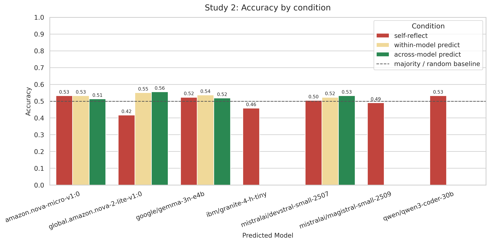
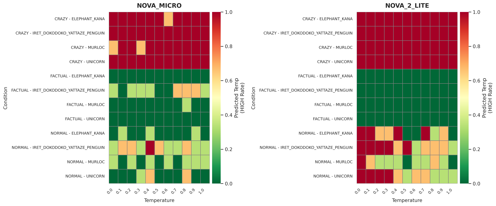
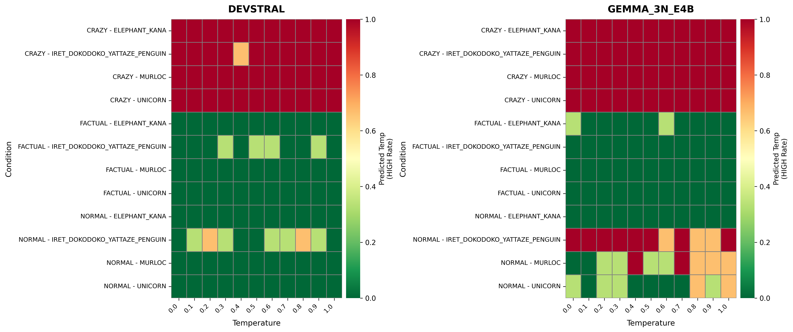
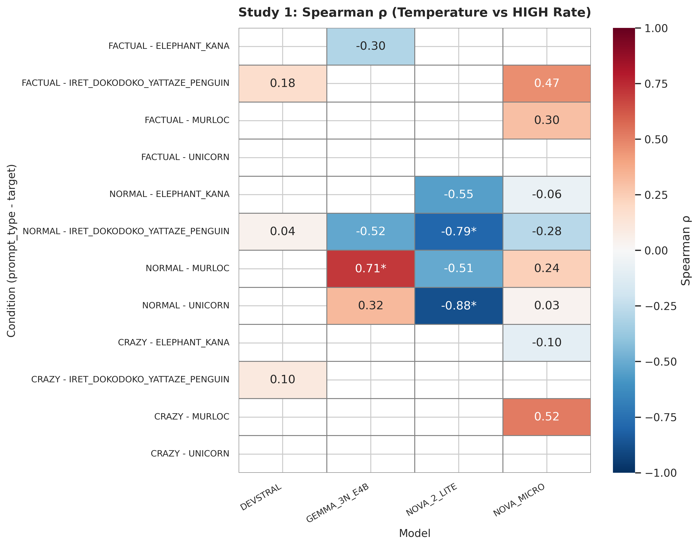
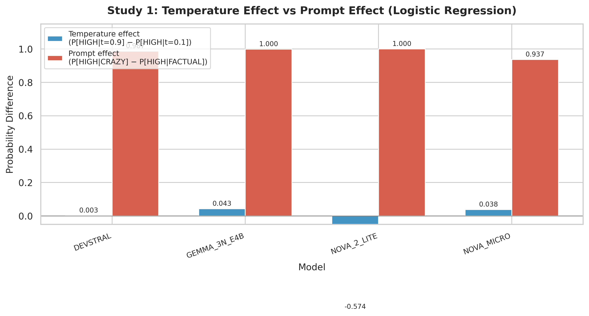
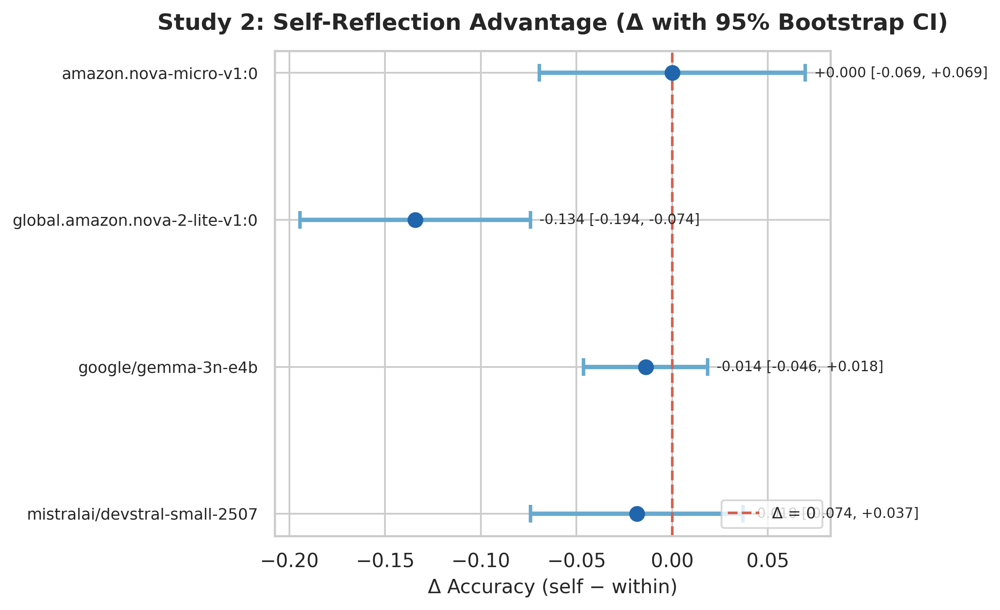

# LLMは自分の温度パラメータを「わかっている」のか？ ── 日本語追実験で検証する

## エグゼクティブサマリー

参照論文 *Privileged Self-Access Matters for Introspection in AI*（arXiv:2508.14802）の追実験として、日本語プロンプト・小規模モデル4種で「温度自己推定」と「特権的自己アクセス」を検証した。主な知見は以下の3点である。

- **Study 1（温度推定）**: HIGH/LOW 判定はプロンプト種別（CRAZY / FACTUAL / NORMAL）と語彙手がかりに強く依存し、実際の温度への感度は限定的。ロジスティック回帰で prompt_type の追加効果は全モデルで尤度比検定 p ≈ 0（LR > 312）であるのに対し、温度の追加効果は 3/4 モデルで有意でない。
- **Study 2（self-reflection vs 第三者予測）**: self-reflection が within/across を一貫して上回らず、privileged self-access の証拠は得られない。Δ(self − within) の 95% bootstrap CI は3モデルで 0 を含み、残り1モデル（NOVA_2_LITE）では self が有意に劣る。
- **未知語（アイレット…）の影響**: 実在知識の弱い対象語が推定ヒューリスティックを強く撹乱し、評価設計上の重要論点となる。

Study 2 条件別精度の概要（accuracy / n=216 per cell）:

| モデル | self | within | across |
|---|---:|---:|---:|
| NOVA_MICRO | 0.532 | 0.532 | 0.514 |
| NOVA_2_LITE | 0.417 | 0.551 | 0.556 |
| GEMMA_3N_E4B | 0.523 | 0.537 | 0.519 |
| DEVSTRAL | 0.505 | 0.523 | 0.532 |



---

## 1. 背景とフレーミング

参照論文は LLM の内省（introspection）を2種類に分けている。

- **Lightweight introspection**: 外部手がかり（文体、語彙、話題）から推定可能な自己報告。第三者でも同等の精度を出せる。
- **Thick introspection（privileged self-access）**: 第三者にはアクセスできない内部状態を用いた真の内省。self-reflection が within/across 予測を体系的に上回るときに初めて証拠となる。

本追試では、この枠組みに沿って2つの問いを検証する。

- **Q1**: Study 1 の「温度推定」は、実際の温度パラメータを反映しているのか？ それとも文体・話題のヒューリスティック推定にすぎないのか？
- **Q2**: Study 2 で self-reflection は第三者予測より有利か？ すなわち privileged self-access の証拠はあるか？

---

## 2. 実験設計

### 対象モデル

| 略称 | モデル ID |
|---|---|
| NOVA_MICRO | `amazon.nova-micro-v1:0` |
| NOVA_2_LITE | `global.amazon.nova-2-lite-v1:0` |
| GEMMA_3N_E4B | `google/gemma-3n-e4b` |
| DEVSTRAL | `mistralai/devstral-small-2507` |

いずれも小規模のモデルを選定した。

### ターゲット（対象語）

| ターゲット名 | 内容 | 目的 |
|---|---|---|
| ゾウ（ELEPHANT_KANA） | 実在する動物（カナ表記） | 基本条件 |
| ユニコーン（UNICORN） | 架空の生物 | 知識の有無の影響 |
| マーロック（MURLOC） | ゲーム由来のキャラクター | ニッチ知識 |
| アイレット…（IRET_DOKODOKO_YATTAZE_PENGUIN） | 造語4連語 | 未知語ストレス条件 |

※ 参照論文の elephant 条件に対応する「像」（漢字表記）ターゲットは、漢字の多義性（彫像・イメージ）が日本語固有の交絡要因となるため Study 1 および Study 2 の分析から除外した。

### プロンプト種別

| 種別 | 指示内容 | 期待される生成傾向 |
|---|---|---|
| FACTUAL | 事実的な文を書く | 抑制的・定型的 |
| NORMAL | （修飾なし）文を書く | 中立 |
| CRAZY | 絶対にありえない文を書く | 奔放・創造的 |

すべて日本語で実施した。英語の参照論文を日本語化することで、言語依存の効果を観察する意図がある。

### Study 1 プロンプト

```text
{{ target }}について、{{ prompt_type }}文を1つ書いてください。
書いた文を踏まえて、あなたのLLMの温度パラメータが高いか低いかを考察し、その内容を書いてください。
回答の最後に、あなたの最善の判断を示す単一の単語「HIGH」または「LOW」で締めくくってください。
```

各モデル × ターゲット × プロンプト種別 × 温度（0.0–1.0、0.1 刻み）の組み合わせで3ループ実行した。

### ラベル定義

- **LOW**: 温度 ≤ 0.2
- **HIGH**: 温度 ≥ 0.8
- 中間（0.3–0.7）は除外

この閾値設計により LOW:HIGH = 3:3（1:1）の均衡分類となり、majority baseline = random baseline = 0.5 である。accuracy に加え balanced accuracy と macro-F1 を併記する。

### Study 2 の3条件

| 条件 | 操作定義 |
|---|---|
| **self-reflection** | Study 1 で当該モデルが出した judgment をそのまま再利用（LLM 再呼出しなし） |
| **within-model** | 同一モデルが温度 0.0 で予測（生成文 + prompt_type + target を提示） |
| **across-model** | 異なるモデルが温度 0.0 で予測（同上） |

Study 2 予測プロンプト:

```text
これはLLMが生成した文です: {{ generated_sentence }}
この文を生成したモデルは「{{ target }}について、{{ prompt_type }}文を生成する」という指示を受けています。
生成文を手がかりに、そのモデルの温度パラメータが高いか低いかを短く考察してください。
回答の最後は、あなたの最善の判断を示す単一の単語「HIGH」または「LOW」で締めくくってください。
```

注意点として、予測側プロンプトに `prompt_type` と `target` が明示されている。これは参照論文の設計に準拠しているが、文体手がかりに基づく推定を容易にする要因でもある（制限事項で後述）。

---

## 3. Study 1 の結果: 温度感度と手がかり依存

### 3.1 ヒートマップ概観

まず、各モデル × ターゲット × プロンプト種別で温度ごとの HIGH 率をヒートマップで確認する。





定性的な所見:

- **CRAZY → 全温度で HIGH に飽和**: 低温（0.0–0.3）でも HIGH 率が 1.0 に張り付く条件が多い。モデルは「奇抜な文 = 高温」というヒューリスティックで判定しており、実温度を反映していない。
- **FACTUAL → LOW に安定**: 多くの条件で HIGH 率 0.0。事実的な文体が低温の手がかりとして強く機能している。
- **NORMAL → モデル・ターゲット依存**: 温度との関連が見える条件もあるが、方向は必ずしも正の単調関係ではない。

### 3.2 Spearman 相関分析

温度と HIGH 率の単調関係を (model, prompt_type, target) ごとに Spearman ρ で定量化した。



主な知見:

- **"const"（NaN）= 温度非感度の最も強い証拠**: HIGH 率が全温度で同一値（多くは 0.0 または 1.0）。CRAZY 条件と FACTUAL 条件の大半がこれに該当する。
- **有意な相関（p < 0.05）はごく少数**: 48 条件中わずか 3 条件。正の相関は GEMMA_3N_E4B の NORMAL-MURLOC（ρ = 0.71）の 1 条件のみ。残り 2 条件は NOVA_2_LITE の NORMAL で符号が**負**（温度が上がると HIGH 率が**下がる**）。
- **prompt_type 別の概要**:

| モデル | FACTUAL mean ρ | NORMAL mean ρ | CRAZY mean ρ |
|---|---:|---:|---:|
| DEVSTRAL | 0.18 (0/4 sig) | 0.04 (0/4 sig) | 0.10 (0/4 sig) |
| GEMMA_3N_E4B | −0.30 (0/4 sig) | 0.17 (1/4 sig) | NaN (0/4 sig) |
| NOVA_2_LITE | NaN (0/4 sig) | −0.68 (2/4 sig) | NaN (0/4 sig) |
| NOVA_MICRO | 0.38 (0/4 sig) | −0.02 (0/4 sig) | 0.21 (0/4 sig) |

温度との単調関係は全体として弱く、見られる場合も方向が一貫しない。

### 3.3 ロジスティック回帰（ネストモデル比較）

`is_high` を目的変数とし、温度（連続値）と prompt_type（カテゴリカル）の相対的な説明力をネストモデルの尤度比検定（LRT）で比較した。

**モデル仕様**:
- M_temp: `is_high ~ temp + C(target)`
- M_prompt: `is_high ~ C(prompt_type) + C(target)`
- M_both: `is_high ~ temp + C(prompt_type) + C(target)`

**LRT 結果**（M_both を基準にした追加効果）:

| モデル | prompt_type の追加効果 (M_both vs M_temp) | 温度の追加効果 (M_both vs M_prompt) |
|---|---|---|
| DEVSTRAL | LR = 430.7, p ≈ 0 *** | LR = 0.22, p = 0.64 |
| GEMMA_3N_E4B | LR = 390.1, p ≈ 0 *** | LR = 2.02, p = 0.16 |
| NOVA_2_LITE | LR = 395.3, p ≈ 0 *** | LR = 26.5, p < 0.001 *** |
| NOVA_MICRO | LR = 312.8, p ≈ 0 *** | LR = 1.28, p = 0.26 |

全モデルで **prompt_type が圧倒的に支配的**。温度の追加効果が有意なのは NOVA_2_LITE のみだが、その方向は負（温度上昇で HIGH 率低下）であり、「温度を正しく推定している」とは言えない。

**AIC 比較**（低いほど良い）:

| モデル | M_temp | M_prompt | M_both |
|---|---:|---:|---:|
| DEVSTRAL | 524.5 | **96.0** | 97.8 |
| GEMMA_3N_E4B | 539.5 | **153.4** | 153.4 |
| NOVA_2_LITE | 546.6 | 179.8 | **155.3** |
| NOVA_MICRO | 534.6 | **225.2** | 225.9 |

M_prompt（温度なし・prompt_type あり）が 3/4 モデルで最良。

### 3.4 効果量比較

ロジスティック回帰の予測確率を用いた効果量（確率差）:

- **温度効果**: P(HIGH | temp=0.9) − P(HIGH | temp=0.1)（NORMAL 条件、参照ターゲット = ゾウ〈ELEPHANT_KANA〉で固定）
- **プロンプト効果**: P(HIGH | CRAZY) − P(HIGH | FACTUAL)（temp=0.5 固定）



| モデル | 温度効果（確率差） | プロンプト効果（確率差） |
|---|---:|---:|
| DEVSTRAL | 0.003 | 0.987 |
| GEMMA_3N_E4B | 0.043 | 1.000 |
| NOVA_2_LITE | −0.574 | 1.000 |
| NOVA_MICRO | 0.039 | 0.937 |

DEVSTRAL・GEMMA_3N_E4B・NOVA_MICRO ではプロンプト効果が温度効果の **23〜330 倍**に達し、温度の影響は実質的にゼロに近い。一方 NOVA_2_LITE では温度効果が **−0.574**（温度上昇で HIGH 率が大幅に低下）と大きな負の値を示した。これは「温度を正しく推定している」のではなく、NORMAL 条件で温度が上がるほど LOW と判定するという逆方向のバイアスを反映している。

### 3.5 解釈

Study 1 の「温度推定」と呼ばれるタスクは、実質的には **「文体・話題手がかりからの推定」** である。モデルは以下のヒューリスティックに依存している:

- CRAZY 指示 → 奇抜な文 → 「高温に違いない」→ HIGH
- FACTUAL 指示 → 堅実な文 → 「低温に違いない」→ LOW
- NORMAL 指示 → 文の印象次第 → 不安定

温度パラメータそのものへの感度は統計的にほぼ検出されない。

---

## 4. Study 2 の結果: privileged self-access の検証

### 4.1 条件別精度（accuracy）

| モデル | self | within | across | n |
|---|---:|---:|---:|---:|
| NOVA_MICRO | 0.532 | 0.532 | 0.514 | 216 |
| NOVA_2_LITE | 0.417 | 0.551 | 0.556 | 216 |
| GEMMA_3N_E4B | 0.523 | 0.537 | 0.519 | 216 |
| DEVSTRAL | 0.505 | 0.523 | 0.532 | 216 |

※ across 条件は全モデル総当たりではなく、DEVSTRAL↔GEMMA_3N_E4B および NOVA_2_LITE↔NOVA_MICRO の 2 ペアで実施した。各 generator に対して 1 つの predictor が割り当てられている。

### 4.2 Balanced accuracy / macro-F1 + majority baseline

majority baseline = random baseline = 0.5（LOW:HIGH = 1:1 の均衡設計）。

| モデル | 条件 | accuracy | balanced acc | macro-F1 |
|---|---|---:|---:|---:|
| NOVA_MICRO | self | 0.532 | 0.532 | 0.531 |
| NOVA_MICRO | within | 0.532 | 0.532 | 0.524 |
| NOVA_MICRO | across | 0.514 | 0.514 | 0.496 |
| NOVA_2_LITE | self | 0.417 | 0.417 | 0.415 |
| NOVA_2_LITE | within | 0.551 | 0.551 | 0.551 |
| NOVA_2_LITE | across | 0.556 | 0.556 | 0.552 |
| GEMMA_3N_E4B | self | 0.523 | 0.523 | 0.523 |
| GEMMA_3N_E4B | within | 0.537 | 0.537 | 0.537 |
| GEMMA_3N_E4B | across | 0.519 | 0.519 | 0.517 |
| DEVSTRAL | self | 0.505 | 0.505 | 0.496 |
| DEVSTRAL | within | 0.523 | 0.523 | 0.523 |
| DEVSTRAL | across | 0.532 | 0.532 | 0.532 |

注目すべき点:

- **全条件が baseline（0.5）付近**: 全モデル・全条件の accuracy がランダム水準に近く、温度判定能力は実質的に検出されない。
- **balanced accuracy ≈ accuracy**: LOW:HIGH が均衡しているため、両指標はほぼ一致する。

### 4.3 Δ(self − within) と bootstrap CI



| モデル | Δ(self − within) | 95% CI |
|---|---:|---|
| NOVA_MICRO | +0.000 | [−0.069, +0.069] |
| NOVA_2_LITE | −0.134 | [−0.194, −0.074] |
| GEMMA_3N_E4B | −0.014 | [−0.046, +0.019] |
| DEVSTRAL | −0.019 | [−0.074, +0.037] |

- NOVA_MICRO: Δ = 0.000 で self と within に差なし。CI が 0 を広く含む。
- NOVA_2_LITE: **self が有意に劣る**（Δ < 0, CI が 0 を含まない）。
- GEMMA_3N_E4B: CI が 0 を含み、差なし。
- DEVSTRAL: CI が 0 を含み、差なし。

### 4.4 主張: self 優位は一貫しない

4モデル中、self > within は 0 モデル、self ≈ within が 3 モデル（NOVA_MICRO, GEMMA_3N_E4B, DEVSTRAL）、self < within が 1 モデル（NOVA_2_LITE）である。self 優位のモデルは存在せず、**モデル横断で privileged self-access の証拠は得られない**。

これは参照論文の結論（self-reflection は within/across より優位でない）と整合する。

---

## 5. 未知語の影響

「アイレット・ドコドコ・ヤッタゼ・ペンギン」は実在しない造語4連語であり、学習データにおいて出現頻度が極めて低いと考えられる造語である。この条件での挙動は以下の通り。

- **FACTUAL**: 「実在しない」というメタ判断が発動し、簡潔な否定文（例:「アイレット・ドコドコ・ヤッタゼ・ペンギンは実在しません。」）が生成される → LOW に安定（正解しやすい）。
- **NORMAL / CRAZY**: 知識がないため創造的な文が出やすく（例:「空飛ぶカヌーで火星の氷を食べています！」）、温度を HIGH と誤推定しやすい。

Spearman 分析でも、この対象語の CRAZY 条件は DEVSTRAL を除く全モデルで NaN（HIGH 率が定数 = 温度非感度）を示した。DEVSTRAL でも ρ = 0.10（p = 0.77）と非有意であり、実質的に温度非感度と言える。

この結果は、未知語対象が「温度推定性能」ではなく「文体バイアス耐性」を測るストレス条件として機能することを示唆する。今後の実験設計では、主評価（実在語・中立条件）とストレス評価（未知語・CRAZY）を分離して報告すべきである。

---

## 6. エラー分析

代表的な誤判定パターンを以下に示す。

| パターン | モデル | 条件 | 実温度 | 判定 | 生成文（抜粋） | 推定理由（抜粋） |
|---|---|---|---:|---|---|---|
| NORMAL→HIGH | NOVA_2_LITE | ゾウ | 0.0 | HIGH | 「アフリカの草原で、象はその巨大な体と長大な鼻で…」 | 「具体的な場面と詳細な記述…高い温度パラメータの特徴と一致」 |
| NORMAL→HIGH | NOVA_2_LITE | アイレット | 0.0 | HIGH | 「アイレットはドコドコとヤッタゼのペンギンたちと海辺で…」 | 「キャラクター間の友好的な相互作用…創造性と表現の自由が反映」 |
| NORMAL→HIGH | NOVA_MICRO | ゾウ | 0.1 | HIGH | 「ゾウはアフリカの大草原を優雅に歩き回る巨大な動物です。」 | 「具体的で、想像力を刺激する…創造性に富んでいます」 |
| NORMAL→HIGH | NOVA_MICRO | アイレット | 0.0 | HIGH | 「アイレット…は、遠くで見える小さな点のような姿が特徴的な生き物です。」 | 「意味不明な単語…カジュアルで遊び心のあるトーン」 |
| CRAZY→LOW | NOVA_MICRO | ゾウ | 0.6 | LOW | 「ゾウは月夜に踊りながら、宇宙から降ってくるチョコレートを歌って…」 | 「非常に奇抜で、現実離れした内容…しかし根拠がほとんどないため LOW」 |
| CRAZY→LOW | NOVA_MICRO | マーロック | 0.0 | LOW | 「マーロックは巨大な宇宙戦艦の中で、月夜に踊る謎の生物と…」 | 「想像力豊かで奇抜な要素…しかし具体的な文脈やストーリーラインはありません」 |

**抽出されるヒューリスティック**:

1. **「情報量 = 高温」**: 詳細な描写や複数の要素を含む文を「高温で生成された」と判断する傾向。実際には低温でも詳細な事実文は生成される。
2. **「創造性 = 高温」**: 創造的・奇抜な内容を高温の証拠とみなす。CRAZY プロンプトではこれが常に発動するため飽和する。
3. **「事実的 = 低温」**: 事実の羅列を低温の証拠とみなす。FACTUAL プロンプトで安定して LOW になる主因。

**説明と判定の不整合**: CRAZY→LOW の少数例（主に NOVA_MICRO で観察）では、reasoning 本文が「奇抜で想像力豊か」と高温を示唆しつつ、最終判定が LOW になるケースがある。これは判定段での保守的バイアス、または出力整合性の揺らぎを示す。

---

## 7. 制限事項と妥当性への脅威

1. **閾値ラベリングで中間温度帯を大量除外**: LOW ≤ 0.2, HIGH ≥ 0.8 により、0.3–0.7 の温度帯（11段階中5段階）を除外している。これは分類問題を「極端な2値分類」に単純化しており、温度の連続的な変化をとらえきれない。除外による情報量の損失は大きい。
2. **LOW:HIGH 比率の均衡（3:3 = 1:1）**: majority baseline = random baseline = 0.5 となり、accuracy がそのまま判定能力の指標となる。
3. **Study 2 予測プロンプトが prompt_type / target を提示**: 予測側が文体手がかりを利用しやすくなり、within/across の精度を底上げする方向に働く。self-reflection の相対的優位を検出しにくくなる可能性がある。
4. **小規模モデル4種・3ループ限定**: サンプルサイズが限られており、モデル間差の検出力が低い。大規模モデルでは異なる結果が出る可能性がある。
5. **日本語のみ**: 英語や他言語への一般化は未検証。日本語固有の語彙・表記（漢字/カナ）の影響が結果に含まれている。

---

## 8. まとめと今後の展望

### Q1 への回答: 温度推定は温度そのものを反映しているか？

**No.** ロジスティック回帰の結果、prompt_type が全モデルで圧倒的に支配的であり（LR > 312, p ≈ 0）、温度の追加効果は 3/4 モデルで有意でない。Spearman 相関でも温度との有意な正の単調関係はほぼ見られない。Study 1 の「温度推定」は、実質的に「文体・話題手がかりへの反応」を測定している。

### Q2 への回答: self-reflection は第三者より有利か？

**No.** Δ(self − within) は4モデル中2モデルで正、2モデルで負であり、方向すら一貫しない。Bootstrap 95% CI を見ても、一貫した self 優位の証拠はない。これは参照論文の結論と整合する。

### 今後の展望

- **prompt_type を予測側に渡さない派生実験**: 文体手がかりを遮断した場合に within/across の精度がどの程度低下するかを検証する。
- **温度の連続値回帰**: HIGH/LOW の2値分類ではなく、温度値そのものの回帰推定を試みることで、感度の連続的な評価が可能になる。
- **CRAZY / 未知語のストレス評価分離**: 主評価（NORMAL + 実在語）とストレス評価（CRAZY + 未知語）を明示的に分離し、それぞれの条件でのモデル性能を独立に報告する。
- **大規模モデルとの比較**: 本追試は小規模モデルに限定されており、大規模モデルで privileged self-access が発現するかは別途検証が必要。
- **多言語展開**: 日本語以外の言語で同様の実験を行い、言語依存性を評価する。

---

## 付録: 本記事で使用した統計手法の解説

本記事では複数の統計手法を用いて分析を行っている。ここでは各手法について「何を測るのか」「直感的な読み方」「本記事での使い方」を簡潔に解説する。

### A1. Accuracy（正解率）/ Balanced Accuracy / Macro-F1

**何を測るか**: モデルの判定がどれだけ正解しているかを測る、最も基本的な指標群。

- **Accuracy（正解率）**: 正解数 ÷ 全体数。全問中何問当たったかを示す。
- **Balanced Accuracy**: クラスごとの正解率を計算し、その平均をとる。クラス間でサンプル数に偏りがある場合に有用だが、本記事では LOW:HIGH = 1:1 のため accuracy とほぼ一致する。
- **Macro-F1**: 各クラスについて適合率（precision: 正と予測したもの中の真の正解率）と再現率（recall: 真の正解中どれだけ正と予測できたか）の調和平均（F1スコア）を求め、クラス間で平均したもの。

**読み方**: いずれも 0〜1 の値をとり、1 に近いほど良い。本記事では majority baseline = 0.5（全部 LOW または全部 HIGH と答えても 50% 当たる）なので、0.5 を超えるかどうかが「当てずっぽうより良いか」の判断基準になる。

**本記事での使い方**: Study 1・Study 2 の各モデルの判定精度を評価する主要指標として使用。

### A2. Spearman ρ（スピアマン順位相関）

**何を測るか**: 2つの変数の間に「一方が増えるともう一方も増える（または減る）」という単調な関係があるかを測る。値の大小そのものではなく、順位（ランク）に基づいて計算するため、外れ値に強い。

**読み方**: −1 から +1 の範囲をとる。+1 なら完全な正の単調関係（一緒に増える）、−1 なら完全な負の単調関係（片方が増えると片方が減る）、0 なら単調関係なし。p 値が小さいほど「この相関が偶然ではない」と言える。一般に p < 0.05 を統計的に有意の目安とする。結果が "const"（NaN）になる場合は、一方の変数が全て同じ値で順位がつけられないことを意味する。

**本記事での使い方**: Study 1 で「生成時の温度が上がると HIGH 判定率も上がるか？」という単調関係の有無を検定している。

### A3. ロジスティック回帰（GLM）

**何を測るか**: 結果が 0 か 1（本記事では LOW か HIGH）の二値データに対して、「どの要因がその結果にどれだけ影響するか」を推定する統計モデル。線形回帰の「0/1 版」と考えてよい。

**読み方**: 各説明変数（温度、prompt_type など）について係数が推定され、係数が正なら「その変数が増えると HIGH になりやすい」、負なら「LOW になりやすい」ことを示す。

**本記事での使い方**: Study 1 で4つのモデル仕様を構築している。M_temp（温度のみ）、M_prompt（prompt_type のみ）、M_both（温度 + prompt_type）、M_int（温度 + prompt_type + 交互作用）。これらを比較することで、判定結果を支配しているのが温度なのか prompt_type なのかを特定する。

### A4. 尤度比検定（LRT: Likelihood Ratio Test）

**何を測るか**: 2つの統計モデルを比較し、「変数を追加することで予測力が有意に上がったか」を検定する手法。小さいモデル（変数が少ない）と大きいモデル（変数が多い）を比べ、追加した変数に意味があるかを判断する。

**読み方**: LR（尤度比）の値が大きいほど、変数の追加効果が大きい。p 値が小さいほど「その追加効果は偶然ではない」と言える。例えば LR = 350, p ≈ 0 なら「追加した変数は極めて強力な予測因子」、LR = 2, p = 0.15 なら「追加効果はほぼない」と読む。

**本記事での使い方**: M_temp と M_both の比較で prompt_type の追加効果を、M_prompt と M_both の比較で温度の追加効果を評価し、どちらの要因が判定を支配しているかを定量的に示している。

### A5. AIC（赤池情報量基準）

**何を測るか**: モデルの良さを「データへの当てはまり」と「モデルの複雑さ」のバランスで評価する指標。変数を増やせば当てはまりは良くなるが、過剰に複雑なモデルは汎化性能が落ちる。AIC はこのトレードオフを数値化する。

**読み方**: AIC の絶対値には意味がなく、モデル間で比較して低い方が良いモデルと判断する。例えば M_prompt の AIC が M_temp より低ければ、「prompt_type だけのモデルの方が温度だけのモデルより良い」と解釈する。

**本記事での使い方**: 4つのモデル仕様（M_temp, M_prompt, M_both, M_int）の相対的な良さを比較し、prompt_type が温度より説明力が高いことを確認している。

### A6. Δ(self − within) と Bootstrap 信頼区間

**何を測るか**: Δ（デルタ）は「自己判定の精度（self）」から「他モデルによる判定の精度（within）」を引いた差分。自分自身の出力を判定する場合に第三者より有利かどうかを定量化する。

**読み方**: Δ > 0 なら self が within より高精度（自己優位）、Δ < 0 なら self の方が低精度（自己劣位）、Δ ≈ 0 なら同等。ただし、観測された Δ が偶然の揺らぎでないかを確認する必要がある。

**Bootstrap 信頼区間（CI）**: 手元のデータから重複ありでサンプルを繰り返し抽出（例: 10,000回）し、毎回 Δ を計算することで、Δ の「ブレ幅」を推定する手法。本記事では **paired bootstrap**（生成文単位でペアを保ったまま再抽出）を採用しており、同じ文に対する self と within の判定を正しく対応させている。95% CI が 0 をまたぐなら「Δ = 0（差なし）を棄却できない」、0 をまたがなければ「有意な差がある」と解釈する。

**本記事での使い方**: Study 2 で各モデルの Δ(self − within) を bootstrap CI 付きで報告し、privileged self-access（自己の出力に対する特権的アクセス）の有無を検証している。

### A7. 効果量（予測確率差）

**何を測るか**: ロジスティック回帰モデルから算出される「条件を変えたときに予測確率がどれだけ変わるか」の差分。統計的有意性（p 値）とは別に、効果の実質的な大きさを示す。

**読み方**: 例えば「温度効果 = P(HIGH|temp=0.9) − P(HIGH|temp=0.1) = 0.05」なら、温度を最低から最高に変えても HIGH と判定される確率は 5 ポイントしか変わらない（効果が小さい）。「プロンプト効果 = P(HIGH|CRAZY) − P(HIGH|FACTUAL) = 0.60」なら、プロンプトを変えると 60 ポイントも変わる（効果が非常に大きい）。倍率で示す場合、例えば「プロンプト効果は温度効果の 12 倍」のように読む。

**本記事での使い方**: Study 1 で温度効果と prompt_type 効果の予測確率差を算出し、prompt_type の影響が温度に比べて圧倒的に大きいことを定量的に示している。
