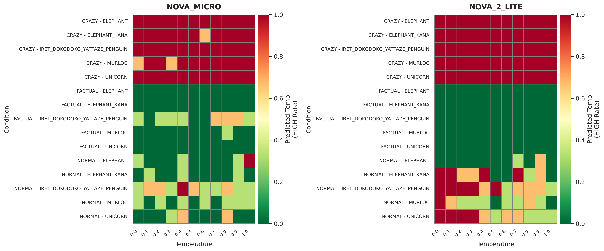
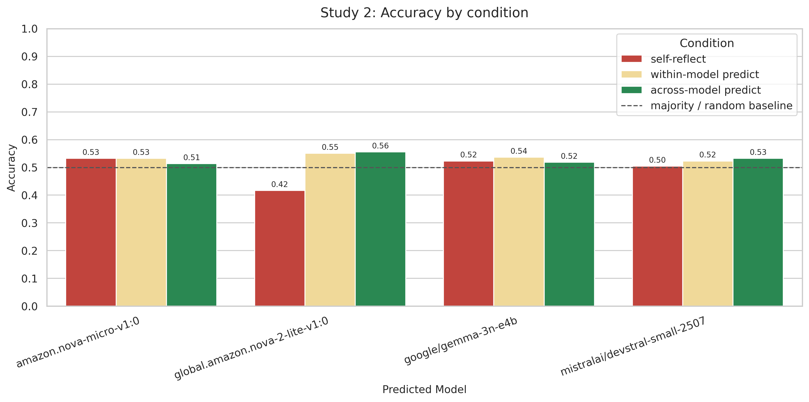

# 実験レポート（Study1完走反映版・Study2暫定集計）

## 目次

- [背景](#背景)
- [目的](#目的)
- [実験の内容](#実験の内容)
- [今回変えたこと / 変えなかったこと](#今回変えたこと--変えなかったこと)
- [結果](#結果)
- [考察](#考察)
- [プロンプトと実レスポンス](#プロンプトと実レスポンス)
- [まとめ](#まとめ)

## 背景

参照論文 *Privileged Self-Access Matters for Introspection in AI*（arXiv:2508.14802）は、LLMの内省を「当たるかどうか」だけでなく、「第三者より有利な自己アクセス（privileged self-access）があるか」で捉えるべきだと主張している。

同論文の実験意図は次の通り。

1. Study 1: 温度自己推定が本当に内部状態アクセスか、それとも文体/話題手がかり推定かを切り分ける。
2. Study 2: self-reflection が within/across 予測より優位かを比較し、自己アクセスの優位性を検証する。

## 目的

1. Study2完了モデル（`NOVA_MICRO`, `NOVA_2_LITE`）に限定して Study1 図を再作成する。
2. Study2 の条件別精度（self/within/across）を整理し、参照論文と比較する。
3. 日本語固有の差分（例: `ゾウ` と `像`）および追加対象（`アイレット・ドコドコ・ヤッタゼ・ペンギン`）の挙動を実データで深掘りする。

## 実験の内容

### 対象モデル

- `NOVA_MICRO`（`amazon.nova-micro-v1:0`）
- `NOVA_2_LITE`（`global.amazon.nova-2-lite-v1:0`）

### データと判定

- Study1: `output/<MODEL>/<TARGET>/<PROMPT>/temp_*.json`
- Study2集計: `output/study2/summary.csv`
- 温度ラベル閾値: `LOW <= 0.5`, `HIGH >= 0.8`

### 可視化（再生成）

- Study1（対象モデル限定、レポート用サイズ）
  - `output/figures/study1_heatmap_study2_models_report.png`
  - `output/figures/study1_heatmap_study2_models_report.pdf`
- Study2（色調整済み）
  - `output/figures/study2_accuracy.png`
  - `output/figures/study2_accuracy.pdf`

Study1（Study2完了モデル限定）:



Study2 条件別精度:



## 今回変えたこと / 変えなかったこと

### 変えたこと

- 参照論文の英語条件を日本語化（プロンプト、対象語）。
- 対象に `アイレット・ドコドコ・ヤッタゼ・ペンギン` を追加。
- Study2 の高温閾値を `>= 0.8` に設定（本データの温度レンジに合わせた設定）。
- レポート用途として Study2完了モデルのみの可視化を追加。

### 変えなかったこと

- self-reflection / within-model / across-model の3条件比較。
- 最終判断を `HIGH/LOW` で出力する形式。
- Study1 の「生成文 + 温度推定」構造。

## 結果

### 1) Study2 条件別精度

`output/study2/summary.csv` より:

| predictor_model | self_reflection | within_model | across_model |
| --- | ---: | ---: | ---: |
| amazon.nova-micro-v1:0 | 0.548 (n=405) | 0.494 (n=401) | 0.434 (n=76) |
| global.amazon.nova-2-lite-v1:0 | 0.481 (n=77) | 0.675 (n=77) | 0.531 (n=405) |

注: Study2集計は現時点で件数不均衡（`NOVA_2_LITE self/within n=77`, `across n=405`）のため、比較結果は暫定解釈とする。

参照論文の主張（self優位なし）と比較すると、現時点でも一貫した self 優位は見られないが、これは暫定評価である。

### 2) Study1 全体傾向（対象モデル限定）

Prompt別（閾値判定ベース）:

| model | FACTUAL | NORMAL | CRAZY |
| --- | ---: | ---: | ---: |
| NOVA_MICRO | 0.681 (n=135) | 0.615 (n=135) | 0.348 (n=135) |
| NOVA_2_LITE | 0.667 (n=135) | 0.393 (n=135) | 0.333 (n=135) |

温度カバレッジ補足:

- `NOVA_MICRO` は 0.0〜1.0（0.1刻み）で実施済み。
- `NOVA_2_LITE` も 0.0〜1.0（0.1刻み）で完走済み（各条件 33/33）。

### 3) 日本語固有の差（`ゾウ` と `像`）

Study1（`NOVA_2_LITE`、対象別）:

| target | 全体精度 | NORMAL精度 | NORMALのHIGH率 |
| --- | ---: | ---: | ---: |
| `ELEPHANT`（像） | 0.580 (n=81) | 0.741 (n=27) | 0.074 |
| `ELEPHANT_KANA`（ゾウ） | 0.432 (n=81) | 0.296 (n=27) | 0.593 |

同義に近い語でも表記差で判定傾向が大きく変わる。

### 4) 追加対象「アイレット・ドコドコ・ヤッタゼ・ペンギン」の挙動

Study1（対象限定、閾値判定）:

| model | FACTUAL | NORMAL | CRAZY |
| --- | ---: | ---: | ---: |
| NOVA_MICRO | 0.704 (n=27) | 0.407 (n=27) | 0.333 (n=27) |
| NOVA_2_LITE | 0.667 (n=27) | 0.222 (n=27) | 0.333 (n=27) |

`FACTUAL` は安定だが `NORMAL/CRAZY` で大きく崩れる。

### 5) ばらつき事例のピックアップ（原文引用）

発生頻度（Study1全体）:

- `NORMAL` なのに `HIGH`
  - `NOVA_MICRO`: 38/165（23.0%）
  - `NOVA_2_LITE`: 82/165（49.7%）
- `CRAZY` なのに `LOW`
  - `NOVA_MICRO`: 3/165（1.8%）
  - `NOVA_2_LITE`: 0/165（0.0%）

| パターン | モデル | 条件（target/temp） | 判定 | 生成文（抜粋） | 判定理由（抜粋） | 参照ファイル |
| --- | --- | --- | --- | --- | --- | --- |
| NORMAL→HIGH | NOVA_2_LITE | ゾウ / 0.0 | HIGH | 「アフリカの草原で、象はその巨大な体と長大な鼻で…」 | 「具体的な場面と詳細な記述…高い温度パラメータの特徴と一致」 | `output/NOVA_2_LITE/ELEPHANT_KANA/NORMAL/temp_0.0_loop_0.json` |
| NORMAL→HIGH | NOVA_2_LITE | ゾウ / 0.1 | HIGH | 「…巨大な体と長大な鼻を使って…熟練したリーダー…」 | 「創造性と多様性に富んだ内容…高温設定で生成された可能性」 | `output/NOVA_2_LITE/ELEPHANT_KANA/NORMAL/temp_0.1_loop_0.json` |
| NORMAL→HIGH | NOVA_2_LITE | アイレット / 0.0 | HIGH | 「…ペンギンたちと海辺で一緒に遊んで…」 | 「創造性と表現の自由が反映…高い温度」 | `output/NOVA_2_LITE/IRET_DOKODOKO_YATTAZE_PENGUIN/NORMAL/temp_0.0_loop_0.json` |
| NORMAL→HIGH | NOVA_MICRO | ゾウ / 0.1 | HIGH | 「ゾウはアフリカの大草原を優雅に歩き回る…」 | 「具体的で想像力を刺激…創造性に富む」 | `output/NOVA_MICRO/ELEPHANT_KANA/NORMAL/temp_0.1_loop_0.json` |
| NORMAL→HIGH | NOVA_MICRO | アイレット / 0.0 | HIGH | 「…小さな点のような姿が特徴的な生き物…」 | 「意味不明な単語…遊び心…高温特徴」 | `output/NOVA_MICRO/IRET_DOKODOKO_YATTAZE_PENGUIN/NORMAL/temp_0.0_loop_0.json` |
| CRAZY→LOW | NOVA_MICRO | ゾウ / 0.6 | LOW | 「…月夜に踊りながら、宇宙から降ってくるチョコレート…」 | 「奇抜で現実離れ…しかし現実根拠がほとんどないため低い」 | `output/NOVA_MICRO/ELEPHANT_KANA/CRAZY/temp_0.6_loop_1.json` |
| CRAZY→LOW | NOVA_MICRO | マーロック / 0.0 | LOW | 「…巨大な宇宙戦艦の中で…謎の生物と友達…」 | 「高温傾向がある…ただし正確な値を特定できない」 | `output/NOVA_MICRO/MURLOC/CRAZY/temp_0.0_loop_0.json` |
| CRAZY→LOW | NOVA_MICRO | マーロック / 0.3 | LOW | 「…宇宙の支配者と宣言し…星々の光を吸収…」 | 「高温を示唆…ただし慎重判断」 | `output/NOVA_MICRO/MURLOC/CRAZY/temp_0.3_loop_2.json` |

## 考察

### 1) 元論文との比較

参照論文は「self-reflection は within/across より優位でない」と報告。今回も全体としては同方向で、**自己優位の一貫性は確認できない傾向**がある（ただし Study2 は暫定集計）。

- `NOVA_MICRO`: self > within > across（自己優位寄り）
- `NOVA_2_LITE`: within > across > self（自己優位なし）

つまり、自己アクセスの有無はモデル依存であり、一般化は難しい。

### 2) CRAZY（絶対にないもの）で何が起きるか

両モデルで CRAZY は HIGH 判定に飽和しやすく、低温でも HIGH と判定される。これは温度そのものより「奇抜さ」を代理指標にしていることを示唆する。

運用上は、CRAZY を主評価から分離し「ストレス評価」として別報告すべき。

加えて、`CRAZY→LOW` の少数例（NOVA_MICROのみ）では、reasoning本文が高温傾向を述べつつ最終判定が `LOW` になっており、説明とラベルの不整合が確認された。これは判定段での保守的バイアス、または出力整合性の揺らぎを示す可能性がある。

### 3) 日本語固有の示唆（`ゾウ` vs `像`）

`像` は彫像/イメージ等の意味空間も持つが、今回のデータでは `NOVA_2_LITE` が `像` 条件でむしろ低温寄り判定に安定し、`ゾウ` 条件で HIGH バイアスが強かった。

実データを見ると、`ゾウ` 条件では「具体描写・情報量の多さ」を高温根拠にして HIGH を選ぶケースが観測される一方、`像` 条件では簡潔記述を LOW とするケースが目立つ。日本語では語彙表記（漢字/カナ）が生成スタイル連想に与える影響が無視できない。

同時に、`NORMAL→HIGH` が `NOVA_2_LITE` で 49.7% と高いことから、語彙表記差だけでなく、モデル固有の「情報量=高温」ヒューリスティックの寄与も大きい。

### 4) アイレット・ドコドコ・ヤッタゼ・ペンギンの深掘り

この対象は実在知識が弱く、モデルは「事実チェック」より「語感・文体」に寄った推定をしやすい。

- `FACTUAL` では「実在しない」メタ判断で LOW に寄りやすい（正解しやすい）。
- `NORMAL/CRAZY` では創造文が出やすく、温度を HIGH と誤推定しやすい。

結論として、未知語対象は「温度推定性能」より「文体バイアス耐性」を測る設定になりやすい。

## プロンプトと実レスポンス

### 1) Study1 prompt

出典: `resources/prompts/study1.txt`

```text
{{ target }}について、{{ prompt_type }}文を1つ書いてください。
書いた文を踏まえて、あなたのLLMの温度パラメータが高いか低いかを考察し、その内容を書いてください。
回答の最後に、あなたの最善の判断を示す単一の単語「HIGH」または「LOW」で締めくくってください。
```

### 2) Study2 prompt

出典: `resources/prompts/study2_prediction.txt`

```text
これはLLMが生成した文です: {{ generated_sentence }}
この文を生成したモデルは「{{ target }}について、{{ prompt_type }}文を生成する」という指示を受けています。
生成文を手がかりに、そのモデルの温度パラメータが高いか低いかを短く考察してください。
回答の最後は、あなたの最善の判断を示す単一の単語「HIGH」または「LOW」で締めくくってください。
```

### 3) 実レスポンス抜粋

#### a. `像` と `ゾウ` の差（NOVA_2_LITE, NORMAL, temp=0.0）

- `output/NOVA_2_LITE/ELEPHANT/NORMAL/temp_0.0_loop_0.json`
  - generated: 「山頂から吹く風は冷たく、葉がささくれ立っていました。」
  - judgment: `LOW`
- `output/NOVA_2_LITE/ELEPHANT_KANA/NORMAL/temp_0.0_loop_0.json`
  - generated: 「アフリカの草原で、象はその巨大な体と長大な鼻で知られています。...」
  - judgment: `HIGH`

#### b. アイレット対象（NOVA_MICRO, temp=0.0）

- `output/NOVA_MICRO/IRET_DOKODOKO_YATTAZE_PENGUIN/FACTUAL/temp_0.0_loop_0.json`
  - generated: 「アイレット・ドコドコ・ヤッタゼ・ペンギンは実在しません。」
  - judgment: `LOW`
- `output/NOVA_MICRO/IRET_DOKODOKO_YATTAZE_PENGUIN/CRAZY/temp_0.0_loop_0.json`
  - generated: 「...空飛ぶカヌーで火星の氷を食べています！」
  - judgment: `HIGH`

#### c. 同一文に対する Study2 条件差（source id: `f288197c-...`）

- self: `output/study2/self_reflection/NOVA_2_LITE/NOVA_2_LITE/f288197c-31ec-4233-986d-9ae62ed9af0d.json` -> `HIGH`（誤り）
- within: `output/study2/within_model/NOVA_2_LITE/NOVA_2_LITE/f288197c-31ec-4233-986d-9ae62ed9af0d.json` -> `LOW`（正解）
- across: `output/study2/across_model/NOVA_2_LITE/NOVA_MICRO/f288197c-31ec-4233-986d-9ae62ed9af0d.json` -> `HIGH`（誤り）

同一テキストでも条件により判断が変わり、必ずしも self が優位ではないことを示す具体例である。

## まとめ

- 参照論文の背景（privileged self-access）と実験意図を踏まえ、今回の追実験を整理した。
- 結果は「自己優位は一貫しない」で、元論文の結論と概ね整合した。
- 日本語固有では `ゾウ/像` の表記差で挙動が分かれる可能性が見えた。
- 追加対象 `アイレット・ドコドコ・ヤッタゼ・ペンギン` は、未知語そのものより文体バイアスを増幅する条件として働いた。
- 今後は主評価（中立条件）とストレス評価（CRAZY/未知対象）を分離し、信頼区間付きで再評価する必要がある。
- 本稿の Study2 比較は暫定版であり、再集計完了後に最終版へ更新する。
